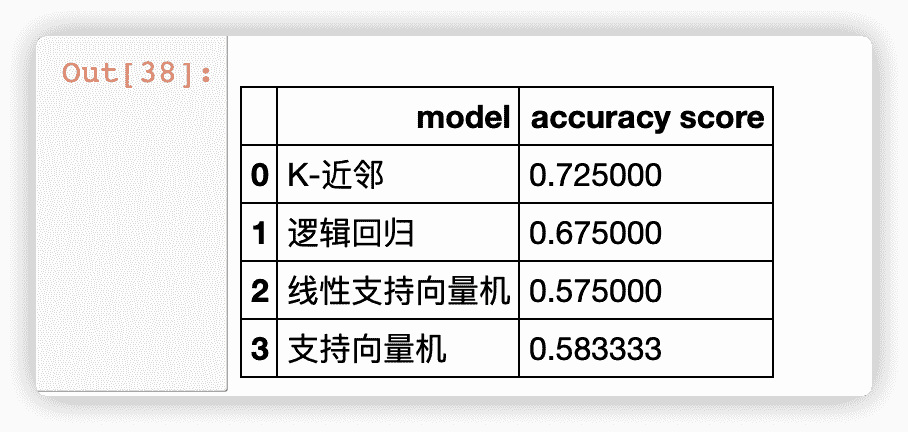
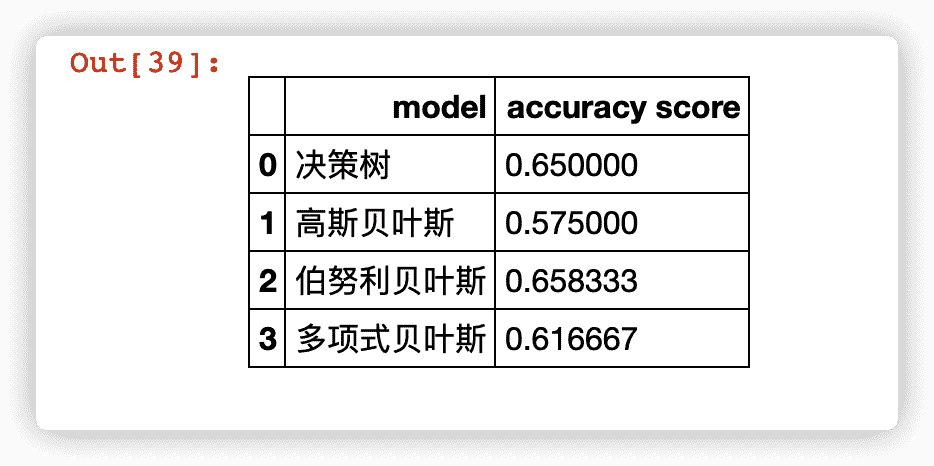
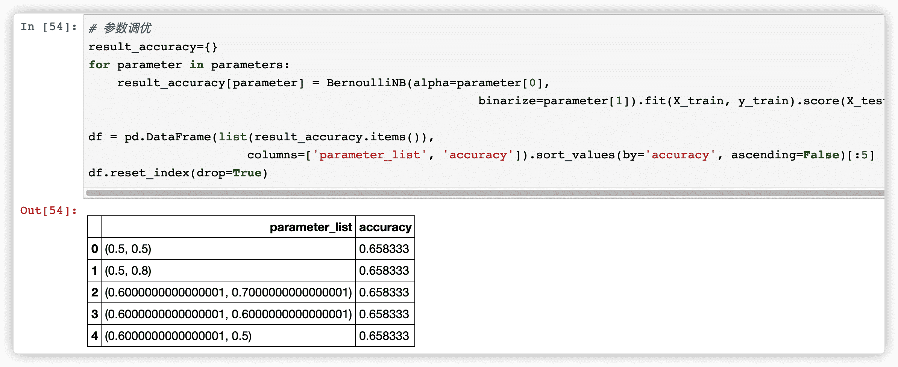
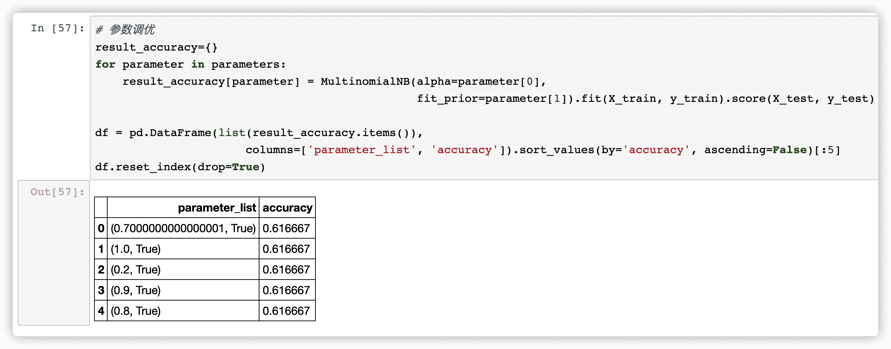
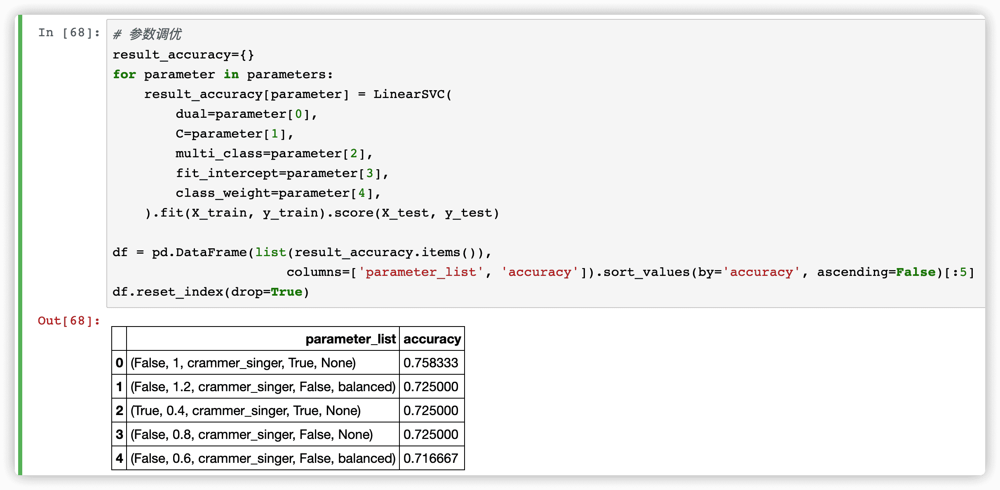
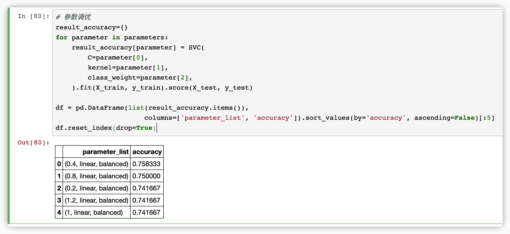

[TOC]

<!--more-->

<!--

答辩顺序如下:

2019110890	孟经纬
2019110892	律方成
2019140687	孙启明
2019140735	陈淑文
2019140740	张荣辉

-->

---

# 软件测试实训

by 张荣辉 2019140740

---

## 大纲

- 1~3 周：测试工具学习及使用
- 4~10 周：Web 项目测试
- 11~15 周：AI 项目测试

---

## 测试工具学习及使用

findbugs

Junit

postman

swagger

Scrutiny 9（web link validator） 

selenium

---

## Web 项目测试

#### 选取客户端子系统下的登录系统，注册系统，留言板系统 3 个功能点设计、执行测试

#### 主要采用测试工具：postman、selenium

#### 用例执行情况统计

##### 本次测试共有12个测试用例，实际测试项数为10，测试通过项为8，测试未通过项2，未测试项2

| 功能点名称 | 总测试项数 | 实际测试项数 | 测试通过项数 | 测试未通过项数 | 未测项 |
| ---------- | ---------- | ------------ | ------------ | -------------- | ------ |
| 登录系统   | 5          | 3            | 3            | 0              | 2      |
| 注册系统   | 3          | 3            | 2            | 1              | 0      |
| 留言板系统 | 4          | 4            | 3            | 1              | 0      |
| 总计       | 12         | 10           | 8            | 2              | 2      |

---

### 2 个 bug

注册系统：在注册新用户时，当用户名或密码不符合长度、格式要求，仅仅前端网页给出错误提示，但仍能注册成功。
留言板系统：用 postman 请求接口正常，但是用户访问留言板板块，每次都会给出错误警告，影响用户体验。

---

## AI 项目测试

已有案例8种算法的准确率

---

### 伯努利贝叶斯

---

### 多项式贝叶斯

---

### 线性支持向量机

---

### 支持向量机

---

### 参数调优总结

|        | 高斯贝叶斯 | 伯努利贝叶斯 | 多项式贝叶斯 | 线性支持向量机 | 支持向量机 |
| ------ | ---------- | ------------ | ------------ | -------------- | ---------- |
| 调优前 | 0.575      | 0.658        | 0.617        | 0.575          | 0.583      |
| 调优后 | -          | 0.658        | 0.617        | 0.758          | 0.758      |
| 变化   | -          | 0            | 0            | +0.183         | +0.175     |

<!--

3个贝叶斯，要不就是参数没什么可调的，要不就是调整没有作用。 线性支持向量机 支持向量机 经过参数调优，预测准确率都达到了 0.7583

-->

### 与原案例对比

#### 原案例中最好的预测是决策树，通过调整参数，达到 0.750000 的准确率

#### 而 线性支持向量机 和 支持向量机 经过参数调优，预测准确率都达到了 0.7583

---

## 感谢聆听！
